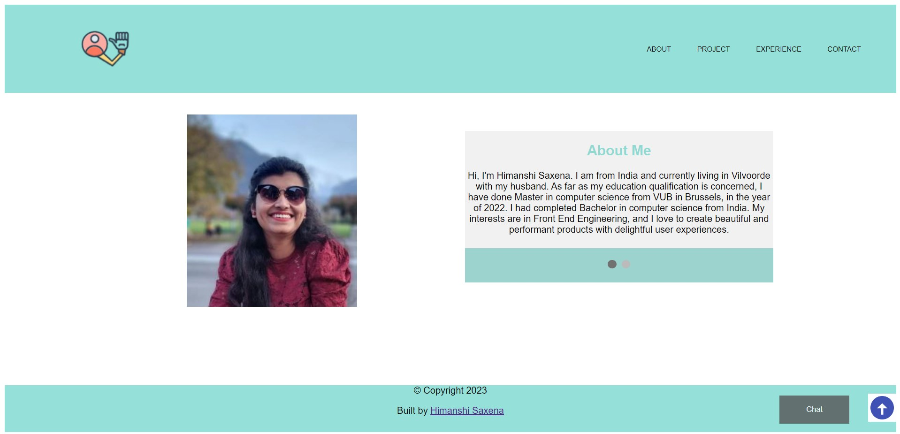

# Portfolio

This is my personal portfolio website designed to showcase my work, projects,
technologies, skills and training. It could include my resume, a summary of
skills, images of class projects and design samples.

## Table of contents

- [Portfolio](#name-of-project)
  - [Table of contents](#table-of-contents)
  - [General info](#general-info)
  - [Screenshots](#screenshots)
  - [Technologies](#technologies)
  - [Setup](#setup)
  - [Status](#status)
  - [Contact](#contact)

## General info

In this project, this is a unique way to showcase my work and let others know
about myself. It’s like an evergreen platform for my projects, case studies, and
information about myself. In addition, it’s one of the best ways to express my
personality, experience, and capabilities.

## Screenshots

## Technologies

- Npm
- VS code
- HTML 5
- CSS

## Setup

- Clone repo
- Npm install

## Status

Project is: _Done_

## Contact

[Himanshi Saxena](https://github.com/himanshisaxena)
